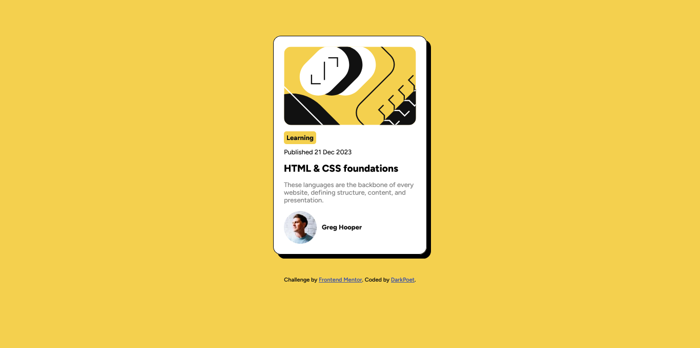

# Frontend Mentor - Blog preview card solution

This is a solution to the [Blog preview card challenge on Frontend Mentor](https://www.frontendmentor.io/challenges/blog-preview-card-ckPaj01IcS). Frontend Mentor challenges help you improve your coding skills by building realistic projects. 

## Table of contents

- [Overview](#overview)
  - [The challenge](#the-challenge)
  - [Screenshot](#screenshot)
  - [Links](#links)
- [My process](#my-process)
  - [Built with](#built-with)
- [Author](#author)

## Overview

### The challenge

Users should be able to:

- See hover and focus states for all interactive elements on the page

### Screenshot

### Links

- Solution URL: [https://github.com/Ojay16/Blog_Preview_Card.git]
- Live Site URL: [https://ojay16.github.io/Blog_Preview_Card/]

### Built with

- Semantic HTML5 markup
- CSS custom properties
- Flexbox
- Mobile-first workflow

## Author

- Website - [Julius Ojemare](https://ojay16.github.io/Portfolio/)
- Frontend Mentor - [@Ojay16](https://www.frontendmentor.io/profile/Ojay16)
- Twitter - [@Ojay_Of_Esan](https://x.com/Ojay_Of_Esan)